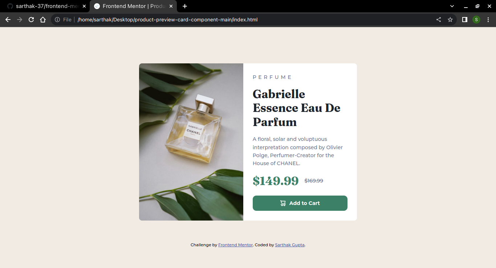

# Frontend Mentor - Product preview card component solution

This is a solution to the [Product preview card component challenge on Frontend Mentor](https://www.frontendmentor.io/challenges/product-preview-card-component-GO7UmttRfa). Frontend Mentor challenges help you improve your coding skills by building realistic projects. 

## Table of contents

- [Overview](#overview)
  - [The challenge](#the-challenge)
  - [Links](#links)
- [My process](#my-process)
  - [Built with](#built-with)
- [Author](#author)

## Overview

### The challenge

Users should be able to:

- View the optimal layout depending on their device's screen size
- See hover and focus states for interactive elements

### Screenshot

### Links

- Solution URL: https://www.frontendmentor.io/solutions/product-preview-card-component-tVxQPpBinB
- Live Site URL: https://sarthak-37.github.io/product-preview-card-component-main/

## My process

### Built with

- Semantic HTML5 markup
- CSS properties
- Flexbox
- Media Queries
- Google Fonts

## Author

- Instagram - [@sarthak.code](https://instagram.com/sarthak.code)
- Frontend Mentor - [@sarthak-37](https://www.frontendmentor.io/profile/sarthak-37)
- Twitter - [@sarthak_code](https://www.twitter.com/sarthak_code)
